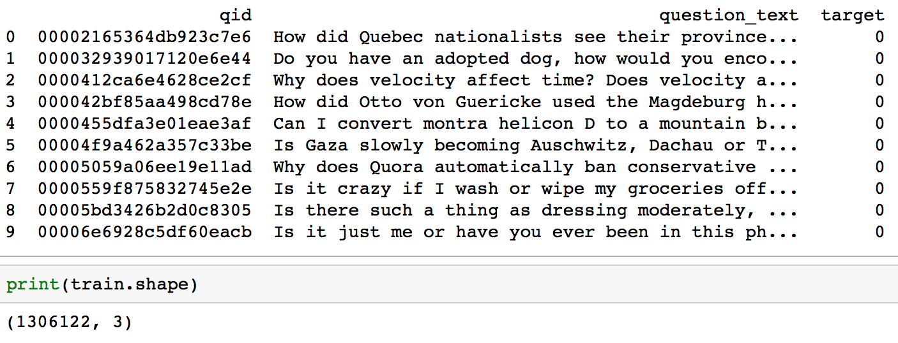
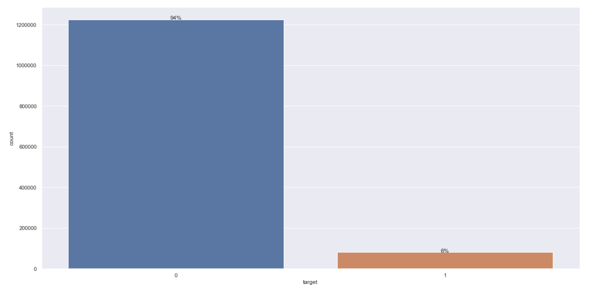
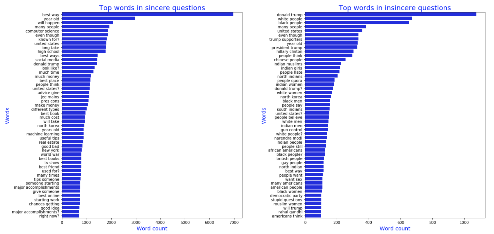
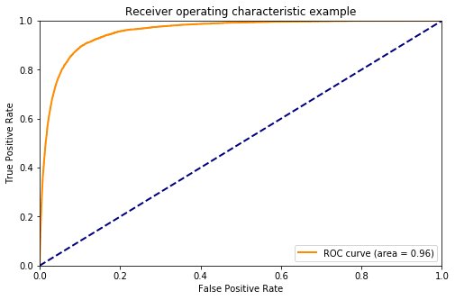
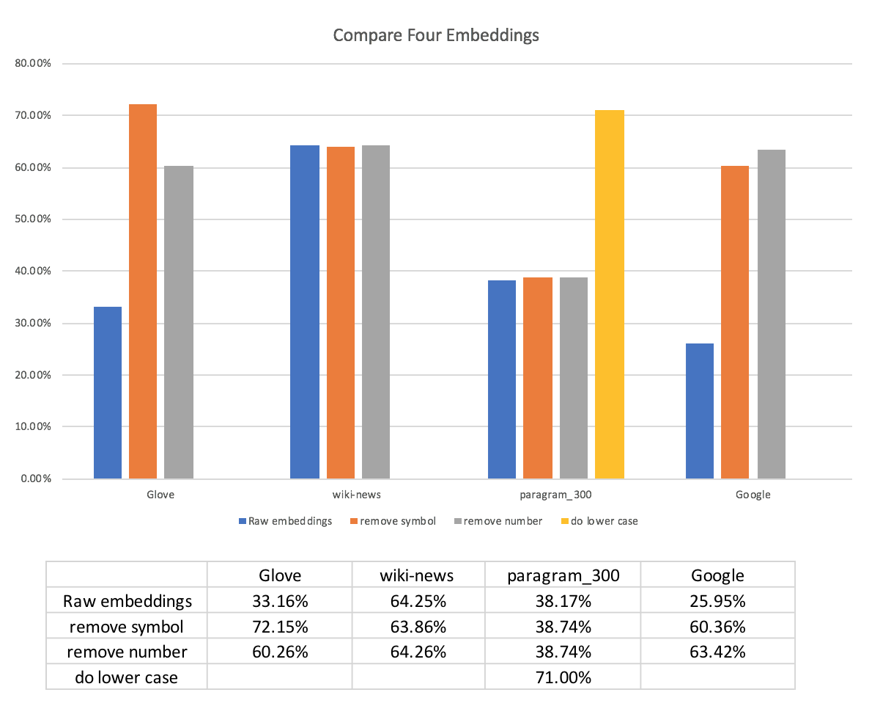
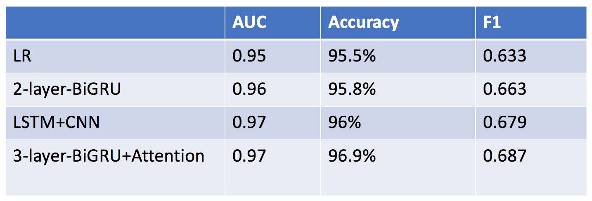

# Insincere-Questions-Classification

## Problem Description:
We are living in an era that majority of world are connected by Internet. On one side, we are earning money, respect and knowledge from social web by producing, sharing and looking up helpful contents; On the other side, some people use social web to promote hatred and violence against individuals or groups based on race, religion, sexual orientation, etc.  

We explored different Machine Learning approaches and built a text classification predictive model to detect inappropriate texts. By filtering inappropriate contents, users with questions feel happier and easier to ask and find information they need hence they will be more active; Experienced people feel happier to share their knowledge because more people will appreciate and make good use of their contribution. With a more peaceful and active communication environment, social web platforms expect to have a steady growth and earning. 

## Exploratory Data Analysis
Here are some findings from our Exploratory Data Analysis.

1. Data size and shape: 1.3 millions * 3

2. Data is heavily imbalanced: 94% of texts are non-toxic and 6% are toxic.

3. Sincere questions are more about technology, material life, emotional needs, whereas Insincere questions are more about race, religion, politics.

## Logistic Regression Classifier:
We choose TF-IDF as text feature and transfer all text into vectors. First we used logistic regression model to classify the question whether it is sincere or not. After we get prediction, we made a ROC curve in order to show the AUC score and also calculated precission. Both of them are methods to evaluate this model. The two scores are high which means this model perform well. 

However, our dataset is unbalanced, which will influence the accuracy of AUC score and precision. Thus, we choose F1 score as a new method to evaluate this mode. Contrary to earlier results, F1 score is only 0.63. This result shows that logistic regression is not so good.

## Neural NetworkClassifier 

### Embeddings and Preprocessing

#### Pre-trained Word Embeddings Useful for Neural Network Model
Word embeddings are a type of word representation that allows words with similar meaning to have a similar representation.
Pretrained word embeddings have proven to be invaluable for improving performance in natural language analysis tasks,
which often suffer from paucity of data. 

#### Data Preprocessing 
NOTE: Don't use standard preprocessing steps like stemming or stop word removal when you have pre-trained embeddings. THe reason being lose valuable information, which would help your Neural Network to figure things out. Our main aim of pre-processing is to get the vocabulary as close to the embeddings as possible and then the embeddings and Neural Network will take of the rest.
The major techniques used to accomplish this are:
1. Fill in missing value by “_na_”
2. Tokenize
3. Padding(fix length or variable length)
4. Embedding Matrix
    
####  Comparision of coverage different embeddings

### Performance of Different models
We used 3 different models,
1. 2-layer BiGRU
2. LSTM+CNN
3. GRU+Attention

Performance of various models is as follows:

